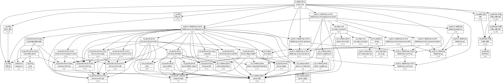
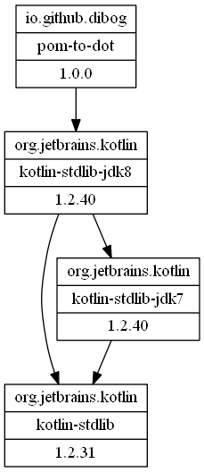
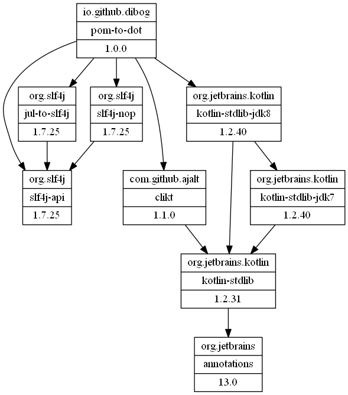
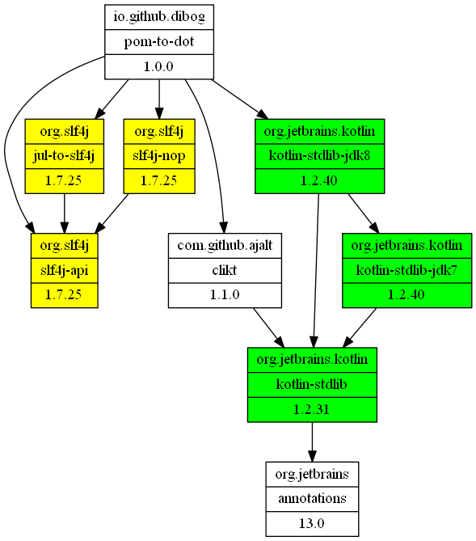

POM-to-DOT
==========

## License

This project is licensed under the [Apache License Version 2.0](https://www.apache.org/licenses/LICENSE-2.0.html).

The copyright owner is Dieter Bogdoll.

## Overview
This project provides a command line tool, to visualize the hierarchical POM
structure with the help of [DOT](https://en.wikipedia.org/wiki/DOT_%28graph_description_language%29)
and [GraphViz](http://graphviz.org/) or [PlantUML](http://plantuml.com/).

All dependencies are assumed to be in your local Maven repository.
 
There is also plugins to use PlantUML with some IDEs:
* IntelliJ: https://plugins.jetbrains.com/plugin/7017-plantuml-integration
* Eclipse: http://plantuml.com/eclipse
* Emacs: http://plantuml.com/emacs
* (add yours here and send me the link) 

## Command line 

After you have build the project with maven, you can rename `target/pom-to-dot-<VERSION>-jar-with-dependencies.jar`
into something shorter like `pom-to-dot.jar`:

Usage: pom-to-dot [OPTIONS]

Usage: pom-to-dot [OPTIONS]

    Options:
      --coord MAVEN_COORD      Maven coordinates. Format:
                               groupId:artifactId:version[:packaging][:classifier]
      --include-dep RE         Regular Expression for only showing the selected ones
      --exclude-dep RE         Regular Expression for excluding the selected ones
      --out-file PATH          File into which the output should be written
      --output-mode MODE       Use DOT to create a .dot file, or PLANT_UML to be
                               used with PlantUML.
                               Defaults to 'DOT'.
      --colors REGEX COLOR...  colors matchign groupIds with thes specified color.
      -h, --help               Show this message and exit

The shortest form to call this is like

    java -jar pom-to-dot.jar --coord io.github.dibog:pom-to-dot:1.0.0
    
which would create a rather big dot file as all the dependencies which
are transitively used will be printed onto the system console.

Whereas
    
    java -jar pom-to-dot.jar --coord io.github.dibog:pom-to-dot:1.0.0 --out-file test.dot
    
stores the output into a file called `test.dot`.

Lets go a bit more in detail over each parameter:

* `--coord` here you specify the root of the graph to be displayed.

* `--internal-dep` here you can specify a regular expression which will
be matched against the group id. The idea is to display your internal dependencies 
differently then the other dependencies.

* `--exclude-dep` lets you specify a regular expression which will again be
matched with the groupId. Every such matched dependency won't appear in the
DOT file.

* `--colors REGEX COLOR ...` every dependecy matching to the REGEX will be colored with COLOR. The parameter can be specified multiple times.

* `--executable` lets you specify the Graphviz/dot binary

* `--output-mode` can be either DOT, PLANT_UML, PNG, GIF, JPG, BMP, PS, EPS or SVG.

* `--out-file` if set the output will be written in that file.

## Examples

### Displaying the full dependencies of this project

    java -jar pom-to-dot.jar --coord io.github.dibog:pom-to-dot:1.0.0 --output-mode PNG --out-file img/full.png
   

### Displaying only dependencies of group 'io.github.dibog' and 'org.jetbrains.kotlin'

    java -jar pom-to-dot.jar --coord io.github.dibog:pom-to-dot:1.0.0 --include-dep "(io.github.dibog|org.jetbrains.kotlin)" --output-mode PNG --out-file img/include.png

### Display the dependencies without 'org.apache.maven' and 'org.jboss.shrinkwrap.resolver'

    java -jar pom-to-dot.jar --coord io.github.dibog:pom-to-dot:1.0.0 --exclude-dep "(org.apache.maven|org.jboss.shrinkwrap.resolver)" --output-mode PNG --out-file img/exclude.png

### Display as above but with colored dependencies

   java -jar pom-to-dot.jar --coord io.github.dibog:pom-to-dot:1.0.0 --exclude-dep "(org.apache.maven|org.jboss.shrinkwrap.resolver)" --colors "org.slf4j" yellow --colors "org.jetbrains.kotlin" green --output-mode PNG --out-file img/colored.png

